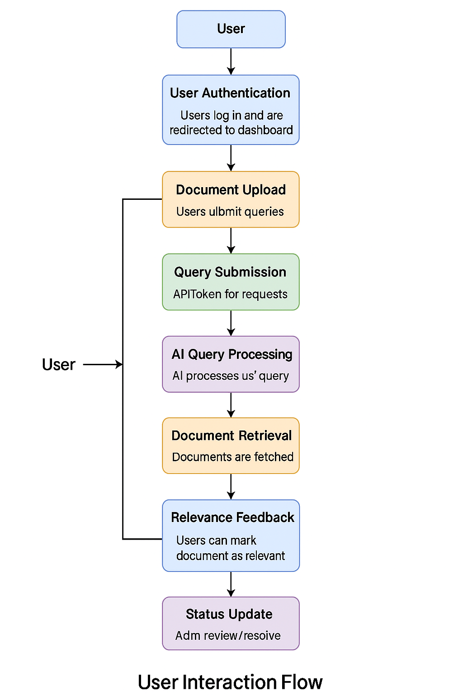
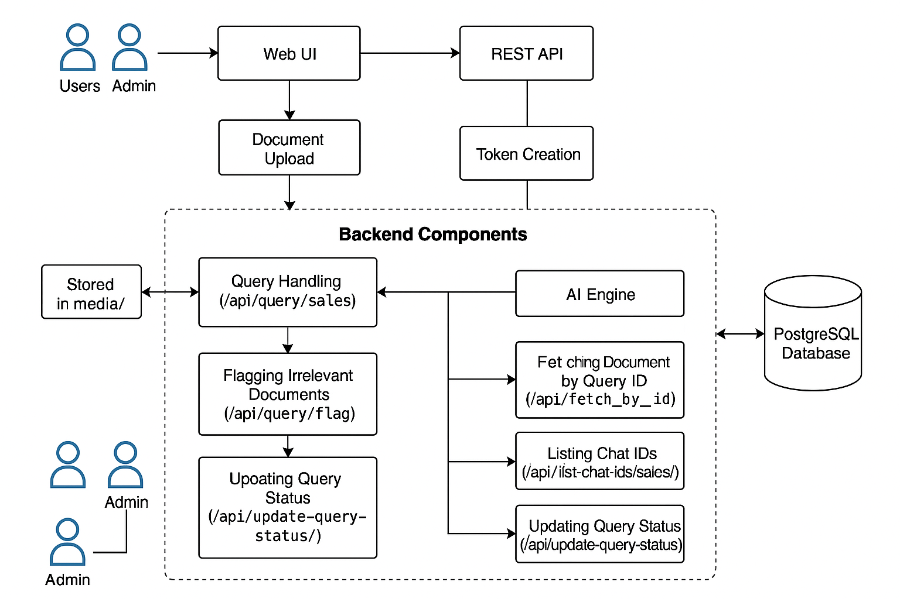
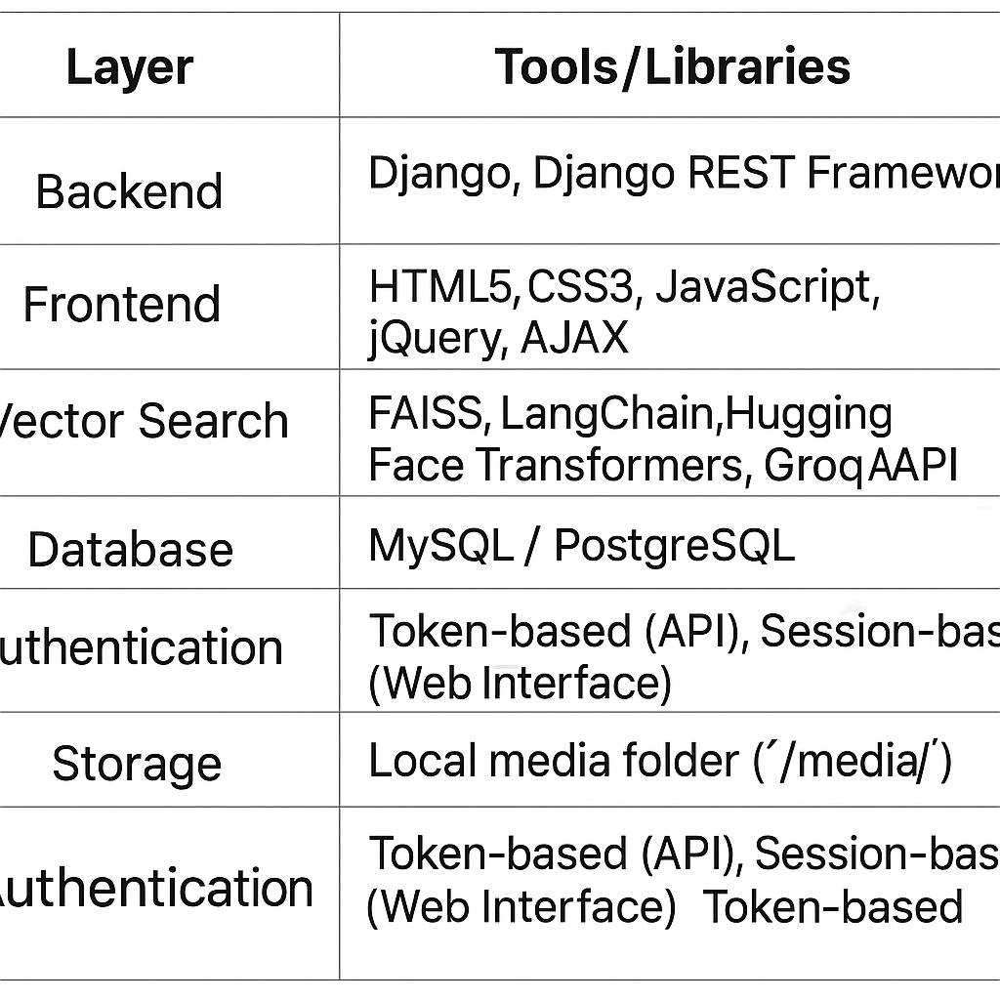

# AI-Powered Query Handling and Document Relevance Management System

An advanced AI-powered query resolution platform built using Django, AI models, and vector databases. It streamlines document-based query handling using Retrieval-Augmented Generation (RAG), secure APIs, and admin-controlled feedback mechanisms.

---

## 📌 Table of Contents

1. [Features](#-features)
2. [System Architecture](#-system-architecture)
3. [Technology Stack](#-technology-stack)
4. [Workflow](#-workflow)
5. [API Endpoints](#-api-endpoints)
6. [Authentication](#-authentication)
7. [Admin Features](#-admin-features)
8. [Future Enhancements](#-future-enhancements)
9. [License](#-license)

---

## 🚀 Features

- Upload and manage PDFs, CSVs, and JSON documents
- AI-powered query responses with document context
- Retrieval-Augmented Generation (RAG) with vector search
- Web and API-based query interface
- Feedback mechanism for document relevance
- Admin dashboard for monitoring and updating statuses
- Secure authentication (session + token-based)

---

## 🏗️ System Architecture

### Components:

- **Frontend (Web UI)**:
  - Upload documents
  - Submit and view queries
  - Real-time response display

- **Backend (Django Server)**:
  - Document management, query handling
  - AI model orchestration

- **Vector Database (FAISS)**:
  - Stores vector embeddings for semantic retrieval

- **AI Layer**:
  - RAG models with LangChain + Hugging Face or Groq API

### Data Flow Diagram (DFD):

1. **Document Upload**:
   - Users upload documents via web interface
2. **Text Extraction & Processing**:
   - Extract text, chunk using `RecursiveCharacterTextSplitter`
3. **Vectorization & Storage**:
   - Convert chunks to vector embeddings
   - Store in FAISS for similarity search
4. **Query Submission**:
   - User submits query
   - System vectorizes and compares with FAISS index
5. **Response Generation**:
   - Relevant chunks are sent to the AI model
   - Final response generated and returned
6. **Feedback**:
   - Users can flag irrelevant results for admin review

---

## 🧰 Technology Stack

---

### Requirements

- Python 3.8+
- FAISS
- MySQL or PostgreSQL
- Hugging Face/Groq API key

## 📡 API Endpoints

| Endpoint                          | Method | Description                               |
|----------------------------------|--------|-------------------------------------------|
| `/api/query/sales/`              | POST   | Submit query and receive AI response      |
| `/api/query/flag/`               | POST   | Flag document as irrelevant               |
| `/api/fetch_by_id/`              | GET    | Get documents linked to query ID          |
| `/api/list-chat-ids/sales/`      | GET    | List sessions and metrics                 |
| `/api/update-query-status/`      | POST   | Update query status (resolved/unresolved) |
| `/chat-details/sales/<chat_id>`  | GET    | View full conversation and document info  |

---

## 🔐 Authentication

- **Web Interface**: Session-based login  
- **API Access**: Token-based  
  - Token created via: `create_dummy_api_token()`  
  - Expires in 7 days by default

---

## 🛡️ Admin Features

- Update query statuses
- View chat/document history
- Track flagged documents
- List active sessions and resolution metrics

---

## 📈 Future Enhancements

- JWT-based stateless authentication
- ElasticSearch integration for faster semantic search
- Analytics dashboard for queries and usage
- Email/Slack alerts for unresolved issues
- Role-based access and user permissions
- Active learning loop for improving relevance

---

